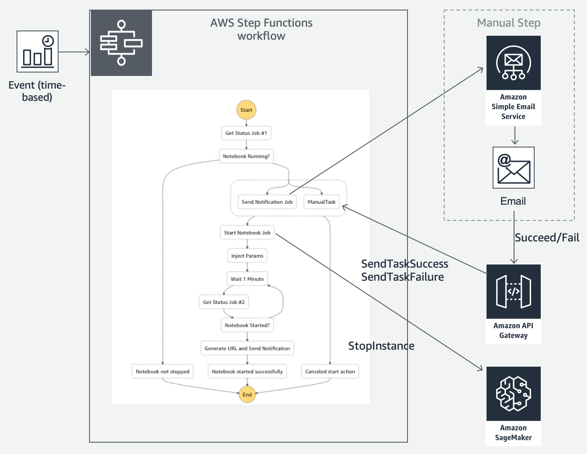
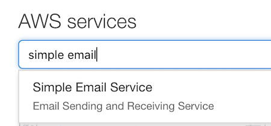
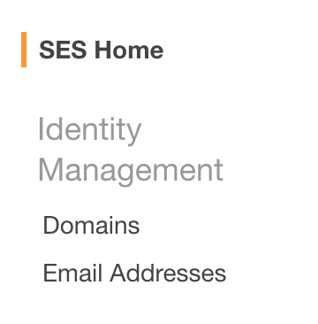
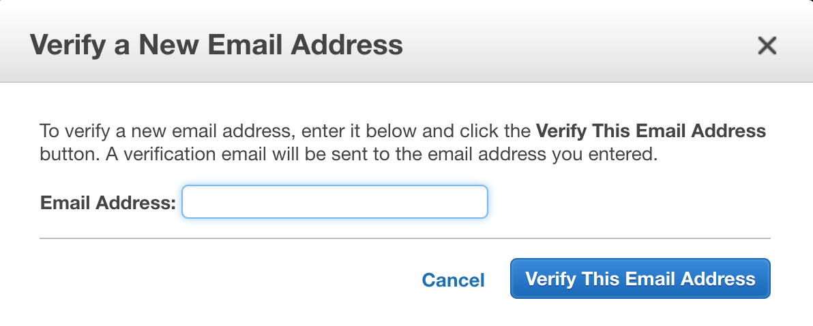
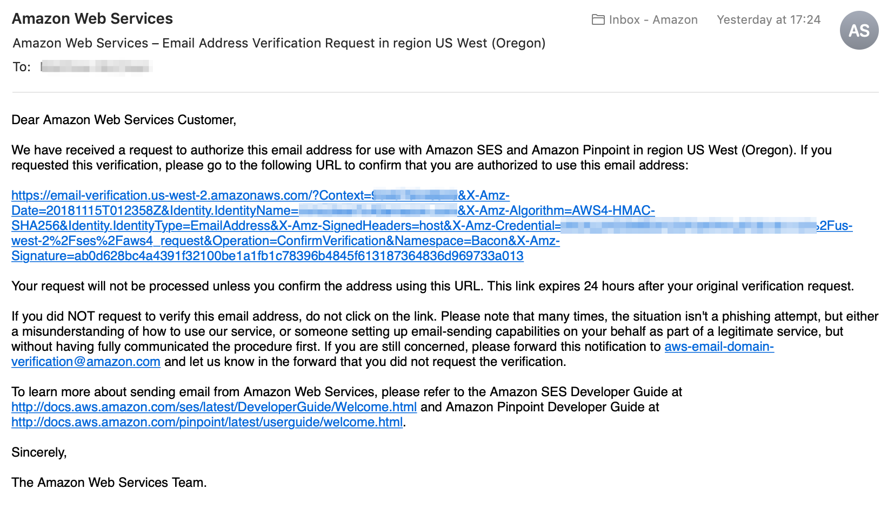

# CDK SageMaker Notebook workflow

The following project is a CDK construct that allows you to setup a project to send email notifications to stop/start SageMaker notebook instances to avoid incurring unnecessary costs.

## Architecture

The following diagram shows the architecture of the solution. The workflow uses a combination of the following services:

* **[CloudWatch Events](https://docs.aws.amazon.com/AmazonCloudWatch/latest/events/WhatIsCloudWatchEvents.html)** that schedule recurring daily events to kick off the workflow.
* **[Step Functions](https://aws.amazon.com/step-functions/)** to manage the workflow.
* **[Simple Email Service (SES)](https://aws.amazon.com/ses/)** to send the email nofication.
* **[API Gateway](https://aws.amazon.com/api-gateway/)** to receive the confirmation or rejection of the stop/start action from the user in the email message.



## Prerequisites

In order to use this library you need to have the following software installed:

* **AWS CLI**. For setup instructions click [here](https://docs.aws.amazon.com/cli/latest/userguide/installing.html).
* **AWS account**. To setup an AWS account goto [this](https://aws.amazon.com/premiumsupport/knowledge-center/create-and-activate-aws-account/) page for details.
* **node.js**. For setup checkout the following [page](https://nodejs.org/).

## Setup instructions

Follow the set of instructions below to setup the CDK. There are a couple of key steps

### Setup CDK

We need to first install the AWS CDK Toolkit. The toolkit is a command-line utility which allows you to work with CDK apps.

Open a terminal session and run the following command:

* Windows: you’ll need to run this as an Administrator
* POSIX: on some systems you may need to run this with `sudo`

```
npm install -g aws-cdk
```

You can check the toolkit version:

```
cdk --version
```

### Configure Simple Email Service (SES)

Now you need to setup Simple Email Service to verify the email address where you will send notifications to. 

1. Log in to the [AWS console](https://aws.amazon.com/console/) then click on the Simple Email Service link (it should be in your history, otherwise find it in the 'Services' on the left or type *simple email service* in the search bar). 



Once on this page, select 'Email Addresses' on the left menu.



2. Select the *Verify a New Email Address* button and enter your email address. 



3.  Open your email client and click on the email address verification link as per the screenshow below.



### Install the project

1. Clone this GitHub repo with the following command:

```
git clone https://github.com/mattmcclean/cdk-sagemaker-notebook-workflow.git
```

2. Goto the project directory and build the CDK stack using the following commands:

```
cd cdk-sagemaker-notebook-workflow
npm install
npm run build
```

3. Now deploy your application using the following CDK command:

```
cdk deploy -c notebook_name=<notebook name> -c email_address=<email address> [-c stop_schedule=<cron expression> -c start_schedule=<cron expression> -c confirm=[true|false]]
```

Replace values for the following parameters:
* `<notebook name>` the name of your SageMaker notebook instance
* `<email address>` the email address to receive the notification and already verified with SES.
* `<cron_expression>` a cron expression which will schedule the notification.

The `confirm` field is optional if you would prefer not to confirm the stop/start actions via email but process automatically.

For example, if you want to launch the worklflow that sends a start reminder every workday (i.e. Mon-Fri) at 9am Pacific time and sends the reminder to stop at 5pm Pacific time then launch with the command below:

```
cdk deploy \
        -c notebook_name=<notebook name> \
        -c email_address=<email address> \
        -c start_schedule="cron(0 17 ? * MON-FRI *)" \
        -c stop_schedule="cron(0 1 ? * TUE-SAT *)"
```

The example below shows the command to to launch the worklflow that automatically starts the notebook instance every workday (i.e. Mon-Fri) at 9am Pacific time and automatically stops it at 5pm Pacific time:

```
cdk deploy \
        -c notebook_name=<notebook name> \
        -c email_address=<email address> \
        -c start_schedule="cron(0 17 ? * MON-FRI *)" \
        -c stop_schedule="cron(0 1 ? * TUE-SAT *)" \
        -c confirm=false
```

Now your application will be deployed to your AWS account.
